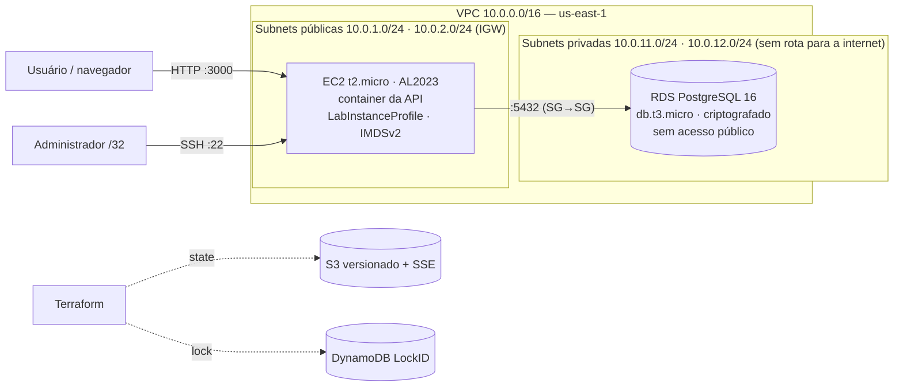

# Relatório do Processo — API de Reservas da TechNova

**Aluno:** Sirlande Martins · **RA:** 6325269 · **Prova do Primeiro Bimestre (Aulas 01 a 07)**

## Ferramenta de IA utilizada

Nesta prova usei o **Claude**, da Anthropic, como agente, com o modelo **Opus 5.5** nos dois agentes —
na IA-revisora, com o nível de esforço alto.

A solução foi construída com duas instâncias de IA em papéis separados: uma **IA-autora**, que escreveu
a spec, o código, as configurações e as evidências, e uma **IA-revisora**, em outro painel, que não
executava nada e só emitia pareceres depois de conferir o estado real do repositório. Todos os prompts
estão registrados em [`evidencias/prompts/`](evidencias/prompts/), e as respostas da revisora em
[`evidencias/specs/revisora/spec-revisora.md`](evidencias/specs/revisora/spec-revisora.md).

---

## Questão 1 — A Jornada Completa (Aulas 01 a 07)

A ordem seguida foi a das dependências entre as camadas, e cada uma foi validada antes de a próxima
começar. O ponto de partida foi a **spec** (Aula 07): requisitos, design e tarefas, escritos e revisados
antes de qualquer código, em três commits `docs:`. A spec fixou as decisões que o resto do projeto
precisava (contrato das rotas, status válidos, DELETE 204, id inválido 404, formato da data) e
transformou o enunciado em 12 tarefas com critério de pronto e evidência esperada.

Com a spec aprovada, veio o **Git** (Aula 01): README, `.gitignore` e uma feature branch por etapa
(`feat/api`, `feat/docker`, `feat/compose`, `feat/infra`, `docs/relatorio`), com Conventional Commits,
commits `docs:` separados dos de código e merge `--no-ff` na `main`, para os merges ficarem visíveis no
histórico. A **API** (Node.js + Express + PostgreSQL) foi testada contra um Postgres temporário antes de
ser containerizada. Em seguida, o **Docker** (Aula 01): imagem multi-stage, dependências só de produção,
código com dono `root` e processo rodando como `node`, com `HEALTHCHECK`. Depois, o **Docker Compose**
(Aula 02): API e banco numa rede própria, volume nomeado para os dados, healthcheck nos dois serviços e a
API esperando o banco ficar saudável. Um smoke test de 17 casos fechou a parte local e foi reaproveitado
depois na AWS.

Só então veio a nuvem. O **remote state** (Aula 05) foi criado primeiro, em `infra/backend/`, porque o
projeto principal precisa do bucket S3 e da tabela DynamoDB já existentes para inicializar. Os **módulos**
da Aula 06 (`vpc`, `security-group`, `ec2`, `rds`) foram copiados literalmente num commit e adaptados ao
Learner Lab em outro, para a diferença ficar rastreável. A composição em `infra/main.tf` junta os
conceitos das Aulas 03 (Terraform, segurança e IAM — aqui, a proibição de criar IAM), 04 (VPC, subnets
públicas e privadas, EC2) e 05 (RDS). A sequência final foi `plan` revisado → `apply` → smoke test na
EC2 → evidências → `destroy`.

Escolhi essa ordem em decorrência dos aprendizados dos TFs anteriores, principalmente o da Aula 07, em
que entendi melhor a execução do Spec-Driven. Por isso, pedi à minha IA-autora que fizesse a prova em
etapas separadas: antes de seguir para a próxima, cada etapa precisava passar pela validação da
IA-revisora e, por fim, pela minha permissão para continuar.

---

## Questão 2 — O Processo com IA como Copiloto

Decidi usar dois agentes com funções diferentes para gerar questionamentos e ajustes nas tomadas de
decisão antes da execução. A IA responsável pela execução cria a tabela de recomendações. A IA revisora
lê essa tabela e, só depois de checar o estado atual do projeto, apresenta a sua análise. Eu leio, tiro
as minhas dúvidas e envio a análise para a IA que executa, que a confere com o estado do projeto,
contesta se discordar e segue o fluxo de trabalho. A decisão final é sempre minha. Escolhi esse fluxo
para facilitar a minha compreensão das decisões por meio dos conceitos técnicos trabalhados. A revisora
roda no Opus 5.5 com esforço alto, que gasta mais tokens; como ela só lê e acompanha os commits, ficou
como avaliadora de apoio, e a IA de execução ficou com a produção principal.

O fluxo Spec-Driven seguiu **requisitos → design → tarefas**, cada fase revisada antes da seguinte. Os
requisitos (R1–R10, com critérios QUANDO/ENTÃO/DEVE, e as restrições do Lab C1–C6) passaram por
decisões minhas: DELETE 204, id inválido 404, data `AAAA-MM-DD`, PUT completo mantendo o status quando
omitido. O design trouxe a arquitetura, o contrato das rotas, o Dockerfile, o Compose e a composição dos
módulos; as tarefas viraram o roteiro de execução, uma de cada vez, com parecer da revisora antes de cada
commit ou `apply` (numerados a partir de V01, desde 29/09, para controlar o repasse entre os painéis).

Os prompts principais foram: ler o enunciado e propor um plano com uma tabela de recomendações; escrever
cada fase da spec; executar cada tarefa conforme o design; e, na AWS, rodar o `plan`, parar para revisão,
aplicar o plano salvo e parar de novo nas capturas do console. A IA gerou bem o que era estrutural e
repetitivo: a spec com rastreabilidade, a API com validação e tratamento de erro, o Dockerfile endurecido,
o Compose com healthchecks, o smoke test, a composição dos módulos e as evidências com os dados sensíveis
mascarados.

O que precisou ser corrigido ficou registrado na tabela de erros (E1–E18) do
[`prompts.md`](evidencias/prompts/prompts.md), sempre depois de verificado contra um fato. Exemplos: o
design não tinha healthcheck explícito da API no Compose (E2) e não alertava que `set -x` no `user_data`
vazaria a senha (E3); o filtro da AMI herdado da Aula 06 também casava com imagens `minimal` e `ecs`
(E15); o plano do Terraform foi salvo com um nome que o `.gitignore` não cobria (E17). A revisora também
errou (E6, E7) e foi contestada com fatos do repositório — no E7, o histórico da Aula 05 provou que o
`untaint` era necessário, e a execução da T6 confirmou.

Comparando com fazer manualmente, minha experiência com a IA foi positiva: com o auxílio dos agentes,
consegui terminar a prova dentro do prazo, enquanto manualmente o prazo ficaria apertado e com risco de
mais erros. O fluxo que adotei permitiu fazer mais correções em pouco tempo. O que mais consumiu tempo
foi o repasse entre os painéis: levar o resumo do trabalho da IA-autora para a IA-revisora analisar e
depois devolver o parecer à autora. Mesmo assim, esse custo também foi positivo para a minha
experiência, porque a revisora fez ajustes e correções ao longo do progresso.

---

## Questão 3 — Infraestrutura, Segurança e o Learner Lab

A arquitetura tem uma VPC com duas subnets públicas e duas privadas em duas zonas de disponibilidade.
A **EC2 fica na subnet pública** porque precisa de IP público e de rota pelo Internet Gateway para duas
coisas: receber as requisições da API na porta 3000 e, no primeiro boot, baixar pacotes, clonar o
repositório e construir a imagem Docker. O **RDS fica nas subnets privadas** porque nenhum cliente
externo deve falar com o banco: ele não tem acesso público (`publicly_accessible = false`), as subnets
privadas não têm rota para a internet (e não há NAT, que o RDS não precisa e é cobrado por hora), e o
Security Group do RDS aceita a porta 5432 apenas a partir do Security Group da EC2, sem nenhum CIDR. O
subnet group em duas AZs é exigência do RDS. O armazenamento é criptografado com a chave `aws/rds`.

O Learner Lab proíbe criar IAM (deny explícito na role `voclabs`), então nenhum recurso `aws_iam_*` foi
escrito. A EC2 recebe o **`LabInstanceProfile`**, que já existe na conta e carrega a `LabRole`, por uma
variável `iam_instance_profile` acrescentada ao módulo `ec2`. Para proteger essas credenciais contra SSRF,
a instância exige IMDSv2 (`http_tokens = "required"`).

O Lab exigiu outros ajustes em relação ao que foi ensinado:

- **Credenciais temporárias:** a sessão dura cerca de 4 horas e as chaves mudam a cada laboratório. Um
  script troca só o perfil `[default]` do `~/.aws/credentials` a partir da área de transferência, e
  `aws sts get-caller-identity` foi o pré-requisito de cada etapa. Antes do primeiro `plan`, interrompi
  a execução para confirmar no painel do Lab que as credenciais eram as do laboratório atual.
- **Região:** `us-east-1` travada por `validation` nas variáveis, nos dois diretórios do Terraform.
- **SCP no S3:** a política da organização nega `s3:GetBucketObjectLockConfiguration`, que o provider AWS
  lê logo depois de criar o bucket. O bucket do state foi criado, a leitura falhou e o recurso ficou
  *tainted*. O contorno foi `head-bucket` (o bucket existe) → `terraform untaint` →
  `plan -refresh=false -target=…` só com versionamento, criptografia e bloqueio de acesso público —
  3 a adicionar, 0 a destruir ([`terraform-backend.txt`](evidencias/terraform-backend.txt)).
- **`dynamodb_table` obsoleto:** o Terraform 1.16 recomenda `use_lockfile`, mas o enunciado exige
  DynamoDB; o parâmetro foi mantido e o warning ficou registrado na evidência do `init`.
- **State do backend:** o state de `infra/backend/` é local (o backend não pode guardar o próprio state
  num bucket que ainda não existe). Há uma cópia de segurança fora do repositório; sem ela, a limpeza do
  bucket e da tabela teria de ser feita manualmente pela CLI.
- **Senha do banco:** vai no `user_data` (para a EC2 montar o `api.env` com modo 600) e fica no
  `terraform.tfstate`. É um trade-off aceito para o escopo da prova, mitigado pelo bucket criptografado
  e privado; ela nunca aparece no `plan`, nos outputs ou nas evidências.

O Lab ficou instável durante o desenvolvimento da prova, mas no dia seguinte consegui acessá-lo e
cumprir os objetivos. Com esta prova, tive uma visão mais clara de como navegar pelo console da AWS,
pesquisando e acessando as suas ferramentas. Como experiência individual, foi positiva.

---

## Questão 4 — Validação e Responsabilidade

Antes de cada `apply`, o `plan` foi salvo em arquivo, revisado por mim e pela IA-revisora e só então
aplicado exatamente como revisado (`terraform apply infra.tfplan`). O checklist aplicado no `plan` foi:

- nenhum recurso `aws_iam_*`; `iam_instance_profile = "LabInstanceProfile"`;
- região `us-east-1`;
- RDS com `publicly_accessible = false` e `storage_encrypted = true`, PostgreSQL 16;
- porta 5432 só a partir do Security Group da EC2, sem CIDR; porta 22 só do meu IP `/32`; porta 3000
  aberta porque a API é pública;
- IMDSv2 obrigatório; senha e `user_data` exibidos como `(sensitive value)`;
- nome da AMI escolhida conferido com `describe-images` (Amazon Linux 2023 padrão, dono `amazon`);
- contagem de recursos igual à esperada: 19 a adicionar, 0 a alterar, 0 a destruir.

A validação não parou no `plan`. Depois do `apply`, o smoke test rodou na EC2 (17/17), uma reserva ficou
gravada e foi lida de volta para provar a persistência no RDS, o `describe-db-instances` confirmou o
banco privado e criptografado, o bucket mostrou duas versões do state e a tabela de lock estava em uso.
As capturas do console confirmaram o mesmo por outro caminho, e cada uma foi conferida antes de entrar no
repositório, com o ID da conta e o meu IP cobertos. Por fim, `plan -destroy` com os mesmos 19 recursos,
`destroy` e a conferência de que nada ficou na conta.

Aceitar o código sem revisar teria deixado passar problemas reais, que foram encontrados neste projeto:
a EC2 poderia subir numa AMI mínima, com resultado diferente a cada data (E15); um `set -x` no
`user_data` teria gravado a senha do banco no log da instância (E3); o plano do backend foi salvo com um nome
que o `.gitignore` não cobria (E17) — o mesmo erro no plano da infraestrutura poderia levar a senha do banco
para o repositório; e, sem o `untaint`, o próximo `apply` destruiria e
recriaria o bucket do state (E7).

Aceitar o código da IA sem a minha leitura e sem a revisão da IA-revisora limitaria o meu entendimento
e seria negativo para o projeto, porque os erros corrigidos durante a prova teriam sido aceitos e
commitados na entrega. Entretanto, reconheço que o meu uso da IA ainda tem muita margem para melhorar,
otimizando a qualidade da entrega e o gasto de tokens de forma mais consciente e prática.

As últimas experiências me deram mais maturidade para usar a IA nos projetos da faculdade e fora dela.
Antes, eu usava a IA como um agente cego, sem restrições: guiava com prompts mais genéricos, deixava
pontos importantes com uma revisão fraca e aceitava as sugestões do agente com mais facilidade. Hoje
reconheço que esse método não é mais adequado, principalmente para os trabalhos mais complexos dos TFs,
e hoje me sinto inseguro em aceitar que a IA continue uma tarefa sem passar por verificação. Também
gostei da metodologia de quebrar o problema em partes e resolver uma etapa de cada vez.
